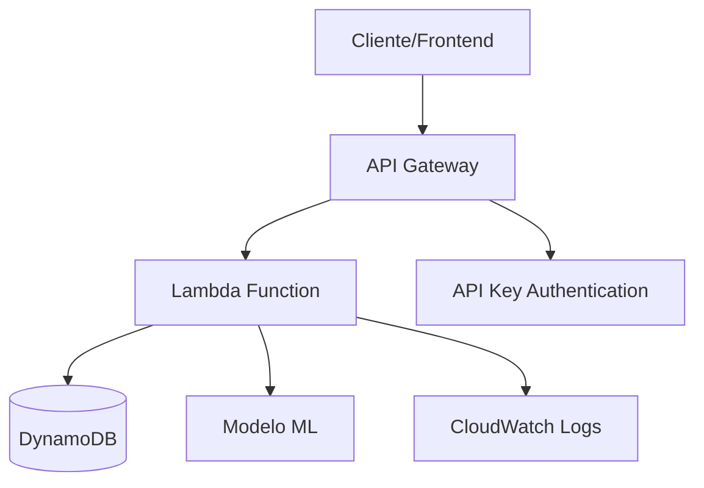

# Documentação Técnica - API de Previsão de Sobrevivência do Titanic

## 📋 Sumário

- [Visão Geral](#visão-geral)
- [Arquitetura](#arquitetura)
- [Infraestrutura AWS](#infraestrutura-aws)
- [API Endpoints](#api-endpoints)
- [Modelos de Dados](#modelos-de-dados)
- [Deploy e Configuração](#deploy-e-configuração)
- [Monitoramento e Logs](#monitoramento-e-logs)
- [Testes](#testes)
- [Segurança](#segurança)

---

## 🔍 Visão Geral

A **API de Previsão de Sobrevivência do Titanic** é uma aplicação serverless desenvolvida para prever a probabilidade de sobrevivência de passageiros do Titanic com base em características demográficas e socioeconômicas.

### Características Principais

- **Arquitetura Serverless**: Implementação usando AWS Lambda para máxima escalabilidade
- **Machine Learning**: Modelo treinado com o dataset histórico do Titanic
- **RESTful API**: Interface padronizada com documentação OpenAPI 3.1
- **Persistência de Dados**: Armazenamento no DynamoDB para consultas futuras
- **Infraestrutura como Código**: Terraform para provisionamento automatizado
- **Monitoramento**: CloudWatch para logs e métricas

---

## 🏗️ Arquitetura

### Diagrama de Arquitetura



### Componentes Principais

| Componente | Tecnologia | Responsabilidade |
|------------|------------|------------------|
| **API Gateway** | AWS API Gateway | Gerenciamento de requests, autenticação, rate limiting |
| **Lambda Function** | Python 3.12 | Processamento de requests, predições ML |
| **DynamoDB** | AWS DynamoDB | Persistência de dados dos passageiros |
| **ML Model** | Scikit-learn | Predição de sobrevivência |
| **CloudWatch** | AWS CloudWatch | Monitoramento e logs |

---

## ☁️ Infraestrutura AWS

A infraestrutura é provisionada através do Terraform e inclui os seguintes recursos:

### 🔧 Recursos Principais

#### 1. **AWS Lambda Function**
```hcl
# Configuração da Lambda
resource "aws_lambda_function" "prediction"
```

**Especificações:**
- **Runtime**: Python 3.12
- **Arquitetura**: ARM64
- **Memória**: 128MB
- **Timeout**: 30 segundos
- **Handler**: `prediction_handler.lambda_handler`

#### 2. **API Gateway**
```hcl
# API REST Gateway
resource "aws_api_gateway_rest_api" "titanic_api"
```

**Endpoints Configurados:**
- `POST /sobreviventes` - Criar predição
- `GET /sobreviventes` - Listar todas as predições
- `GET /sobreviventes/{id}` - Buscar predição por ID
- `DELETE /sobreviventes/{id}` - Deletar predição
- `GET /health` - Health check

#### 3. **DynamoDB**
```hcl
# Tabela de passageiros
resource "aws_dynamodb_table" "passengers"
```

**Configuração:**
- **Nome**: `titanic-survival-api-passengers`
- **Chave Primária**: `passenger_id` (String)
- **Billing Mode**: Pay-per-request
- **Retention de Logs**: 1 dia

#### 4. **IAM Roles e Policies**

**Permissões da Lambda:**
- CloudWatch Logs (criação e escrita)
- DynamoDB (read/write na tabela de passageiros)
- SQS (envio para Dead Letter Queue)

### 📊 Variáveis de Ambiente

| Variável | Valor | Descrição |
|----------|-------|-----------|
| `DYNAMODB_TABLE_NAME` | `titanic-survival-api-passengers` | Nome da tabela DynamoDB |
| `LOG_LEVEL` | `INFO` | Nível de logging |

---

## 🌐 API Endpoints

### Autenticação
Todos os endpoints requerem **API Key** no header `x-api-key`.

### 1. **Criar Predição**
```http
POST /v1/sobreviventes
Content-Type: application/json
x-api-key: {your-api-key}
```

**Request Body:**
```json
{
  "PassengerId": "123",
  "Pclass": 3,
  "Sex": "male",
  "Age": 22.0,
  "SibSp": 1,
  "Parch": 0,
  "Fare": 7.25,
  "Embarked": "S"
}
```

**Response (201):**
```json
{
  "PassengerId": "123",
  "probability": 0.342
}
```

### 2. **Listar Todas as Predições**
```http
GET /v1/sobreviventes
x-api-key: {your-api-key}
```

**Response (200):**
```json
[
  {
    "id": "123",
    "probability": 0.342,
    "passenger_data": { ... },
    "created_at": "2025-01-14T10:30:00Z"
  }
]
```

### 3. **Buscar Predição por ID**
```http
GET /v1/sobreviventes/{id}
x-api-key: {your-api-key}
```

**Response (200):**
```json
{
  "id": "123",
  "probability": 0.342,
  "passenger_data": { ... },
  "created_at": "2025-01-14T10:30:00Z"
}
```

### 4. **Deletar Predição**
```http
DELETE /v1/sobreviventes/{id}
x-api-key: {your-api-key}
```

**Response (200):**
```json
{
  "message": "Passageiro deletado com sucesso",
  "deleted_id": "123"
}
```

### 5. **Health Check**
```http
GET /v1/health
x-api-key: {your-api-key}
```

**Response (200):**
```json
{
  "overall_status": "healthy",
  "services": {
    "lambda": "healthy",
    "dynamodb": "healthy",
    "ml_model": "healthy"
  },
  "timestamp": "2025-01-14T10:30:00Z"
}
```

---

## 📋 Modelos de Dados

### PassengerRequest
```python
class PassengerRequest(BaseModel):
    PassengerId: str
    Pclass: int          # 1, 2 ou 3
    Sex: Literal["male", "female"]
    Age: float           # 0.0 - 120.0
    SibSp: int           # >= 0
    Parch: int           # >= 0
    Fare: float          # >= 0.0
    Embarked: Optional[Literal["S", "C", "Q"]]
```

### Validações
- **Pclass**: Deve ser 1, 2 ou 3
- **Age**: Entre 0 e 120 anos
- **Sex**: Apenas "male" ou "female"
- **SibSp/Parch**: Valores não negativos
- **Fare**: Valor não negativo
- **Embarked**: S (Southampton), C (Cherbourg), Q (Queenstown) ou null

### ErrorResponse
```python
class StandardErrorResponse(BaseModel):
    error_type: str
    message: str
    details: Optional[Dict]
    status_code: int
    timestamp: str
```

---

## 🚀 Deploy e Configuração

### Pré-requisitos
- AWS CLI configurado
- Terraform >= 1.0
- Python 3.12
- Conta AWS com permissões adequadas

### 1. **Deploy da Infraestrutura**
```bash
# Navegar para o diretório de infraestrutura
cd infra/

# Inicializar Terraform
terraform init

# Planejar as mudanças
terraform plan

# Aplicar a infraestrutura
terraform apply
```

### 2. **Build e Deploy do Código**
```bash
# Executar o script de build da layer
python build_layer.py

# O Terraform fará automaticamente o deploy da Lambda
terraform apply
```

### 3. **Configuração da API Key**
Após o deploy, configure a API Key no AWS Console:
1. Acesse API Gateway Console
2. Selecione a API criada
3. Vá em "API Keys" → "Actions" → "Create API Key"
4. Configure o Usage Plan

---

## 📊 Monitoramento e Logs

### CloudWatch Logs
- **Lambda Logs**: `/aws/lambda/titanic-survival-api-prediction-function`
- **DynamoDB Logs**: `/aws/dynamodb/titanic-survival-api-passengers`
- **Retenção**: 1 dia

### Métricas Importantes
- **Lambda Duration**: Tempo de execução
- **Lambda Errors**: Erros na função
- **API Gateway 4XX/5XX**: Erros de cliente/servidor
- **DynamoDB Read/Write Capacity**: Uso da base de dados

### Dead Letter Queue
Configurada para capturar falhas na Lambda:
- **Nome**: `titanic-survival-api-lambda-dlq`
- **Retenção**: 24 horas

---

## 🧪 Testes

### Estrutura de Testes
```
api/tests/
├── conftest.py              # Configurações pytest
├── src/
│   ├── test_config.py       # Testes de configuração
│   ├── test_controller.py   # Testes dos controllers
│   ├── test_handler.py      # Testes do handler principal
│   ├── test_health_check.py # Testes de health check
│   └── ...
```

### Executar Testes
```bash
cd api/
pytest tests/ -v --cov=src/
```

### Testes de Integração
```bash
# Testar endpoint local
curl -X POST http://localhost:8000/sobreviventes \
  -H "Content-Type: application/json" \
  -d '{"PassengerId": "test", "Pclass": 3, ...}'
```

---

## 🔒 Segurança

### Autenticação e Autorização
- **API Keys**: Obrigatórias para todos os endpoints
- **CORS**: Configurado para domínios específicos
- **Rate Limiting**: Implementado via API Gateway

### Boas Práticas Implementadas
- **Validação de Input**: Pydantic para validação rigorosa
- **Error Handling**: Tratamento estruturado de exceções
- **Logging**: Logs detalhados para auditoria
- **Least Privilege**: IAM roles com permissões mínimas

### Dados Sensíveis
- Nenhum dado pessoal identificável é armazenado
- IDs são gerados automaticamente
- Logs não contêm informações sensíveis

---

## 📚 Dependências

### Runtime Dependencies
```
scikit-learn==1.7.0
joblib==1.5.1
pydantic==2.11.7
```

### Infraestrutura
- **AWS Provider**: >= 5.0
- **Terraform**: >= 1.0

---

## 🔧 Configurações Avançadas

### Escalabilidade
- **Auto Scaling**: Lambda escala automaticamente
- **DynamoDB**: Pay-per-request para cargas variáveis
- **API Gateway**: Rate limiting configurável

### Performance
- **Cold Start**: Minimizado com ARM64 e 128MB RAM
- **Layer**: Dependências isoladas em layer separada
- **Caching**: Implementado no API Gateway

### Backup e Recuperação
- **DynamoDB**: Point-in-time recovery habilitado
- **Lambda**: Código versionado no S3
- **Infraestrutura**: Estado Terraform versionado

---

## 📞 Suporte e Manutenção

### Contatos
- **Equipe de Desenvolvimento**: [equipe@exemplo.com]
- **DevOps**: [devops@exemplo.com]

### Troubleshooting Comum
1. **Lambda Timeout**: Verificar logs do CloudWatch
2. **DynamoDB Throttling**: Analisar métricas de capacidade
3. **API Gateway 429**: Revisar rate limits configurados

### Atualizações
- **Modelo ML**: Retreinar periodicamente com novos dados
- **Dependências**: Atualizar bibliotecas mensalmente
- **Infraestrutura**: Revisar recursos AWS trimestralmente

---

*Última atualização: Janeiro 2025*
*Versão da API: 1.0.0*
