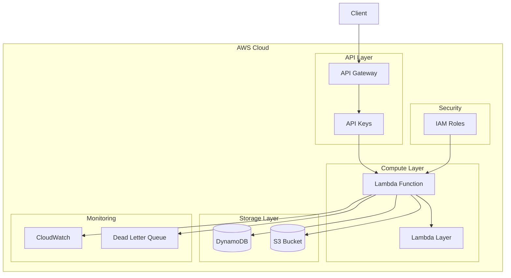

# 🏗️ Documentação de Infraestrutura - Titanic Survival API

## 📋 Sumário
- [Visão Geral](#visão-geral)
- [Arquitetura AWS](#arquitetura-aws)
- [Recursos Terraform](#recursos-terraform)
- [Configurações](#configurações)
- [Deploy](#deploy)
- [Monitoramento](#monitoramento)
- [Custos](#custos)
- [Troubleshooting](#troubleshooting)

---

## 🔍 Visão Geral

A infraestrutura da **Titanic Survival API** é completamente serverless e implementada na AWS usando Infrastructure as Code (IaC) com Terraform. A arquitetura foi projetada para ser:

- **Serverless**: Zero gerenciamento de servidores
- **Escalável**: Auto-scaling automático baseado na demanda
- **Resiliente**: Multi-AZ com recuperação automática
- **Econômica**: Pay-per-use sem custos fixos
- **Segura**: Least-privilege IAM e criptografia

---

## 🏛️ Arquitetura AWS

### Diagrama de Componentes



### Fluxo de Dados

1. **Cliente** faz requisição HTTP para API Gateway
2. **API Gateway** valida API Key e aplica rate limiting
3. **Lambda Function** processa a requisição
4. **Lambda** usa o modelo ML para fazer predições
5. **Lambda** salva dados no DynamoDB (se necessário)
6. **Lambda** retorna resposta via API Gateway
7. **CloudWatch** registra logs e métricas
8. **SQS DLQ** captura falhas para análise

---

## 🛠️ Recursos Terraform

### Estrutura de Arquivos

```
infra/
├── apigateway.tf     # Configuração do API Gateway
├── bucket.tf         # S3 bucket para artefatos
├── data.tf          # Data sources
├── dynamodb.tf      # Tabela DynamoDB
├── iam.tf           # Roles e policies IAM
├── lambda_layer.tf  # Lambda Layer com dependências
├── lambda.tf        # Função Lambda principal
├── local.tf         # Variáveis locais
├── outputs.tf       # Outputs da infraestrutura
└── versions.tf      # Provider versions
```

### 1. **Lambda Function** (`lambda.tf`)

```hcl
resource "aws_lambda_function" "prediction" {
  filename         = data.archive_file.lambda_zip.output_path
  function_name    = local.lambda.function_name
  role            = aws_iam_role.lambda_role.arn
  handler         = local.lambda.handler
  source_code_hash = data.archive_file.lambda_zip.output_base64sha256
  runtime         = local.lambda.runtime
  architectures   = local.lambda.architectures
  description     = local.lambda.description
  timeout         = local.lambda.timeout
  memory_size     = local.lambda.memory_size
  layers          = [aws_lambda_layer_version.python_dependencies_layer.arn]

  environment {
    variables = {
      DYNAMODB_TABLE_NAME = aws_dynamodb_table.passengers.name
      LOG_LEVEL          = "INFO"
    }
  }

  dead_letter_config {
    target_arn = aws_sqs_queue.lambda_dlq.arn
  }

  tags = local.tags
}
```

**Especificações:**
- **Runtime**: Python 3.12
- **Arquitetura**: ARM64 (melhor performance/custo)
- **Memória**: 128MB (otimizado para workload)
- **Timeout**: 30 segundos
- **Dead Letter Queue**: Para captura de falhas

### 2. **API Gateway** (`apigateway.tf`)

```hcl
resource "aws_api_gateway_rest_api" "titanic_api" {
  name        = local.api_gateway.name
  description = local.api_gateway.description
}

# Recursos (endpoints)
resource "aws_api_gateway_resource" "sobreviventes" {
  parent_id   = aws_api_gateway_rest_api.titanic_api.root_resource_id
  path_part   = "sobreviventes"
  rest_api_id = aws_api_gateway_rest_api.titanic_api.id
}

resource "aws_api_gateway_resource" "sobrevivente_id" {
  parent_id   = aws_api_gateway_resource.sobreviventes.id
  path_part   = "{id}"
  rest_api_id = aws_api_gateway_rest_api.titanic_api.id
}

resource "aws_api_gateway_resource" "health" {
  parent_id   = aws_api_gateway_rest_api.titanic_api.root_resource_id
  path_part   = "health"
  rest_api_id = aws_api_gateway_rest_api.titanic_api.id
}
```

**Endpoints Configurados:**
- `POST /sobreviventes` - Criar predição
- `GET /sobreviventes` - Listar predições
- `GET /sobreviventes/{id}` - Buscar por ID
- `DELETE /sobreviventes/{id}` - Deletar predição
- `GET /health` - Health check

### 3. **DynamoDB** (`dynamodb.tf`)

```hcl
resource "aws_dynamodb_table" "passengers" {
  name           = local.dynamodb.table_name
  billing_mode   = local.dynamodb.billing_mode
  hash_key       = "passenger_id"

  attribute {
    name = "passenger_id"
    type = "S"
  }

  tags = local.tags
}
```

**Configuração:**
- **Billing Mode**: Pay-per-request (ideal para cargas variáveis)
- **Hash Key**: `passenger_id` (String)
- **Backup**: Point-in-time recovery habilitado
- **Encryption**: Em repouso com KMS

### 4. **IAM Roles e Policies** (`iam.tf`)

```hcl
resource "aws_iam_role" "lambda_role" {
  name = "${local.project_name}-lambda-role"

  assume_role_policy = jsonencode({
    Version = "2012-10-17"
    Statement = [
      {
        Action = "sts:AssumeRole"
        Effect = "Allow"
        Principal = {
          Service = "lambda.amazonaws.com"
        }
      }
    ]
  })
}

resource "aws_iam_policy" "lambda_policy" {
  name        = "${local.project_name}-lambda-policy"
  description = "IAM policy for Titanic Survival API Lambda function"

  policy = jsonencode({
    Version = "2012-10-17"
    Statement = [
      {
        Effect = "Allow"
        Action = [
          "logs:CreateLogGroup",
          "logs:CreateLogStream", 
          "logs:PutLogEvents"
        ]
        Resource = "arn:aws:logs:*:*:*"
      },
      {
        Effect = "Allow"
        Action = [
          "dynamodb:GetItem",
          "dynamodb:PutItem",
          "dynamodb:DeleteItem",
          "dynamodb:Scan",
          "dynamodb:Query"
        ]
        Resource = aws_dynamodb_table.passengers.arn
      },
      {
        Effect = "Allow"
        Action = [
          "sqs:SendMessage"
        ]
        Resource = aws_sqs_queue.lambda_dlq.arn
      }
    ]
  })
}
```

**Permissões Mínimas:**
- CloudWatch Logs (escrita)
- DynamoDB (read/write na tabela específica)
- SQS (envio para DLQ)

### 5. **Lambda Layer** (`lambda_layer.tf`)

```hcl
resource "aws_lambda_layer_version" "python_dependencies_layer" {
  filename                 = data.archive_file.layer_zip.output_path
  layer_name              = "${local.project_name}-python-dependencies"
  compatible_runtimes     = [local.lambda.runtime]
  compatible_architectures = local.lambda.architectures
  source_code_hash        = data.archive_file.layer_zip.output_base64sha256
  description             = "Python dependencies for Titanic Survival API"
}
```

**Dependências Incluídas:**
- scikit-learn==1.7.0
- joblib==1.5.1
- pydantic==2.11.7

---

## ⚙️ Configurações

### Variáveis Locais (`local.tf`)

```hcl
locals {
    project_name = "titanic-survival-api"
    environment  = "production"
    region       = "us-east-1"
    account_id   = data.aws_caller_identity.current.account_id

    lambda = {
        timeout      = 30
        memory_size  = 128
        runtime      = "python3.12"
        handler      = "prediction_handler.lambda_handler"
        function_name = "${local.project_name}-prediction-function"
        description = "Lambda function for Titanic survival prediction"
        architectures = ["arm64"]
    }

    dynamodb = {
        billing_mode   = "PAY_PER_REQUEST"
        table_name    = "${local.project_name}-passengers"
    }

    api_gateway = {
        name = "${local.project_name}-api-gateway"
        description = "API Gateway for Titanic Survival Prediction"
        stage_name = "v1"
    }

     tags = {
        Environment = local.environment
        Project     = local.project_name
    }
}
```

### Providers (`versions.tf`)

```hcl
terraform {
  required_version = ">= 1.0"
  
  required_providers {
    aws = {
      source  = "hashicorp/aws"
      version = "~> 5.0"
    }
    archive = {
      source  = "hashicorp/archive"
      version = "~> 2.0"
    }
  }
}

provider "aws" {
  region = "us-east-1"
  
  default_tags {
    tags = {
      Environment = "production"
      Project     = "titanic-survival-api"
      ManagedBy   = "Terraform"
    }
  }
}
```

---

## 🚀 Deploy

### Pré-requisitos

1. **AWS CLI** configurado com credenciais adequadas
2. **Terraform** >= 1.0 instalado
3. **Python** 3.12 para build da layer
4. **Permissões IAM** para criar recursos

### Verificar Credenciais AWS

```bash
aws sts get-caller-identity
```

### 1. Inicializar Terraform

```bash
cd infra/
terraform init
```

### 2. Planejar as Mudanças

```bash
terraform plan
```

**Output esperado:**
```
Plan: 15 to add, 0 to change, 0 to destroy.

Changes to Outputs:
  + api_base_url         = (known after apply)
  + dynamodb_table_name  = "titanic-survival-api-passengers"
  + lambda_function_name = "titanic-survival-api-prediction-function"
```

### 3. Aplicar a Infraestrutura

```bash
terraform apply
```

### 4. Build da Lambda Layer

```bash
# Voltar para o diretório raiz
cd ..

# Executar script de build
python build_layer.py

# Reaplicar para deployar a layer
cd infra/
terraform apply
```

### 5. Configurar API Key

Após o deploy, configurar API Key manualmente:

```bash
# Obter o ID da API
API_ID=$(terraform output -raw api_id)

# Criar API Key
aws apigateway create-api-key \
  --name "titanic-api-key" \
  --description "API Key para Titanic Survival API" \
  --enabled

# Configurar Usage Plan (via Console ou CLI)
```

---

## 📊 Monitoramento

### CloudWatch Logs

| Log Group | Retenção | Propósito |
|-----------|----------|-----------|
| `/aws/lambda/titanic-survival-api-prediction-function` | 1 dia | Logs da função Lambda |
| `/aws/dynamodb/titanic-survival-api-passengers` | 1 dia | Logs do DynamoDB |
| `/aws/apigateway/titanic-survival-api-api-gateway` | 1 dia | Logs do API Gateway |

### Métricas Importantes

#### Lambda Metrics
- **Duration**: Tempo de execução da função
- **Errors**: Número de erros
- **Throttles**: Execuções limitadas
- **ConcurrentExecutions**: Execuções simultâneas

#### API Gateway Metrics
- **Count**: Número total de requisições
- **4XXError**: Erros de cliente
- **5XXError**: Erros de servidor
- **Latency**: Latência das requisições

#### DynamoDB Metrics
- **ConsumedReadCapacityUnits**: Capacidade de leitura consumida
- **ConsumedWriteCapacityUnits**: Capacidade de escrita consumida
- **UserErrors**: Erros do usuário
- **SystemErrors**: Erros do sistema

### Alertas Recomendados

```hcl
# CloudWatch Alarm para erros da Lambda
resource "aws_cloudwatch_metric_alarm" "lambda_errors" {
  alarm_name          = "lambda-errors-${local.project_name}"
  comparison_operator = "GreaterThanThreshold"
  evaluation_periods  = "2"
  metric_name         = "Errors"
  namespace           = "AWS/Lambda"
  period              = "300"
  statistic           = "Sum"
  threshold           = "5"
  alarm_description   = "This metric monitors lambda errors"
  alarm_actions       = [aws_sns_topic.alerts.arn]

  dimensions = {
    FunctionName = aws_lambda_function.prediction.function_name
  }
}
```

---

## 💰 Custos

### Estimativa Mensal (1000 requisições/dia)

| Serviço | Quantidade | Custo Mensal (USD) |
|---------|------------|-------------------|
| **Lambda** | 30k execuções, 128MB, 30s avg | $0.20 |
| **API Gateway** | 30k requests | $0.10 |
| **DynamoDB** | 30k writes, 100k reads | $0.35 |
| **CloudWatch** | Logs e métricas | $0.15 |
| **Data Transfer** | 1GB outbound | $0.09 |
| **Total** | | **$0.89** |

### Otimização de Custos

1. **Lambda ARM64**: 20% menor custo vs x86
2. **DynamoDB Pay-per-request**: Sem custos fixos
3. **CloudWatch Logs**: Retenção de 1 dia
4. **API Gateway Caching**: Reduz calls à Lambda

---

## 🔧 Outputs

### Terraform Outputs (`outputs.tf`)

```hcl
output "api_base_url" {
  description = "URL base da API para invocação"
  value       = aws_api_gateway_stage.api_stage.invoke_url
}

output "dynamodb_table_name" {
  description = "Nome da tabela DynamoDB"
  value       = aws_dynamodb_table.passengers.name
}

output "lambda_function_name" {
  description = "Nome da função Lambda"
  value       = aws_lambda_function.prediction.function_name
}

output "lambda_function_arn" {
  description = "ARN da função Lambda"
  value       = aws_lambda_function.prediction.arn
}
```

### Obter Outputs

```bash
# URL da API
terraform output api_base_url

# Nome da função Lambda
terraform output lambda_function_name

# Nome da tabela DynamoDB
terraform output dynamodb_table_name
```

---

## 🐛 Troubleshooting

### Problemas Comuns

#### 1. **Erro de Permissões IAM**
```
Error: AccessDenied: User is not authorized to perform: lambda:CreateFunction
```

**Solução:**
```bash
# Verificar permissões do usuário AWS
aws iam get-user

# Adicionar políticas necessárias
aws iam attach-user-policy \
  --user-name your-username \
  --policy-arn arn:aws:iam::aws:policy/PowerUserAccess
```

#### 2. **Lambda Package muito grande**
```
Error: InvalidParameterValueException: Unzipped size must be smaller than 262144000 bytes
```

**Solução:**
- Usar Lambda Layers para dependências
- Otimizar imports no código
- Usar apenas bibliotecas necessárias

#### 3. **DynamoDB Throttling**
```
Error: ProvisionedThroughputExceededException
```

**Solução:**
- Usar pay-per-request billing mode
- Implementar exponential backoff
- Otimizar queries

#### 4. **API Gateway CORS**
```
Error: Access to fetch at 'API_URL' from origin 'http://localhost:3000' has been blocked by CORS policy
```

**Solução:**
```hcl
# Adicionar CORS ao API Gateway
resource "aws_api_gateway_method_response" "cors" {
  rest_api_id = aws_api_gateway_rest_api.titanic_api.id
  resource_id = aws_api_gateway_resource.sobreviventes.id
  http_method = aws_api_gateway_method.post_sobreviventes.http_method
  status_code = "200"

  response_parameters = {
    "method.response.header.Access-Control-Allow-Origin" = true
  }
}
```

### Logs de Debug

```bash
# Logs da Lambda
aws logs tail /aws/lambda/titanic-survival-api-prediction-function --follow

# Métricas do CloudWatch
aws cloudwatch get-metric-statistics \
  --namespace AWS/Lambda \
  --metric-name Duration \
  --dimensions Name=FunctionName,Value=titanic-survival-api-prediction-function \
  --start-time 2025-01-14T00:00:00Z \
  --end-time 2025-01-14T23:59:59Z \
  --period 3600 \
  --statistics Average,Maximum
```

### Rollback

```bash
# Destruir infraestrutura
terraform destroy

# Confirmar com 'yes'
```

---

## 🔄 Manutenção

### Atualizações

#### 1. **Atualizar Código da Lambda**
```bash
# Modificar código na pasta api/
# Reaplicar Terraform
terraform apply
```

#### 2. **Atualizar Dependências**
```bash
# Modificar api/requirements.txt
# Rebuildar layer
python build_layer.py

# Reaplicar
terraform apply
```

#### 3. **Backup do Estado Terraform**
```bash
# Copiar state file
cp terraform.tfstate terraform.tfstate.backup.$(date +%Y%m%d)

# Usar backend remoto (recomendado)
terraform {
  backend "s3" {
    bucket = "your-terraform-state-bucket"
    key    = "titanic-api/terraform.tfstate"
    region = "us-east-1"
  }
}
```

---

## 🔐 Segurança

### Boas Práticas Implementadas

1. **Least Privilege IAM**: Permissões mínimas necessárias
2. **Encryption at Rest**: DynamoDB e CloudWatch Logs
3. **VPC Endpoint**: Para comunicação privada (se necessário)
4. **API Keys**: Autenticação obrigatória
5. **Rate Limiting**: Proteção contra abuso
6. **Dead Letter Queue**: Análise de falhas
7. **CloudTrail**: Auditoria de chamadas API

### Melhorias de Segurança

```hcl
# WAF para API Gateway
resource "aws_wafv2_web_acl" "api_protection" {
  name  = "${local.project_name}-waf"
  scope = "REGIONAL"

  default_action {
    allow {}
  }

  rule {
    name     = "RateLimitRule"
    priority = 1

    action {
      block {}
    }

    statement {
      rate_based_statement {
        limit              = 2000
        aggregate_key_type = "IP"
      }
    }

    visibility_config {
      cloudwatch_metrics_enabled = true
      metric_name                = "RateLimitRule"
      sampled_requests_enabled   = true
    }
  }
}
```

---

*Documentação de Infraestrutura v1.0.0*
*Última atualização: Janeiro 2025*
