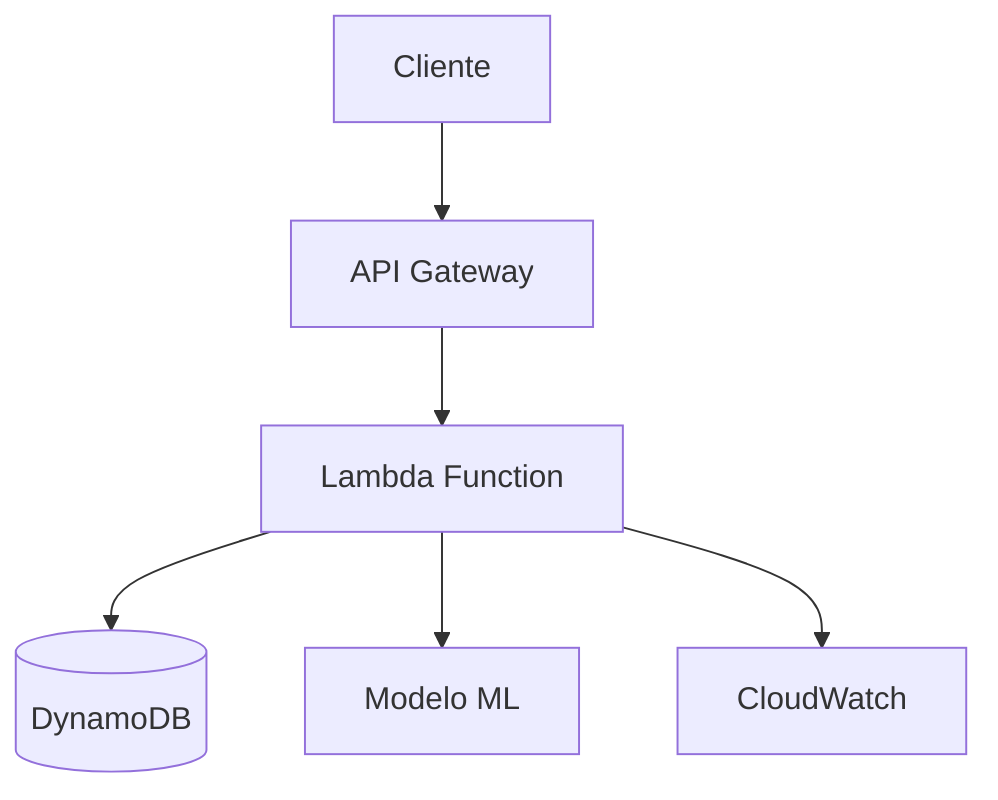

# 🚢 API Para Previsão de Sobrevivência no Titanic

API serverless desenvolvida para prever a probabilidade de sobrevivência de passageiros do Titanic baseada em características demográficas e socioeconômicas, utilizando machine learning e infraestrutura AWS.

## 🎯 Visão Geral

Este projeto implementa uma API REST completa que:
- **Prediz a sobrevivência** de passageiros usando um modelo de machine learning treinado
- **Armazena histórico** de predições para consultas futuras
- **Escala automaticamente** com arquitetura serverless AWS
- **Monitora performance** com logs e métricas em tempo real

## 📚 Documentação

### 📖 Documentações Principais

| Documento | Descrição |
|-----------|-----------|
| **[📋 Documentação Técnica Completa](./DOCUMENTATION.md)** | Visão geral da arquitetura, componentes e funcionamento |
| **[🌐 API Reference](./API_REFERENCE.md)** | Endpoints, exemplos de uso e códigos de erro |
| **[🏗️ Documentação de Infraestrutura](./INFRASTRUCTURE.md)** | Recursos AWS, deploy e configurações Terraform |

### 🔗 Links Rápidos

- **[Swagger/OpenAPI](./swagger/openapi.yaml)** - Especificação da API
- **[Streamlit App](./app/)** - Interface web para testes
- **[Notebooks ML](./api/modelos/)** - Treinamento e análise do modelo
- **[Testes](./api/tests/)** - Suite de testes automatizados

## 🚀 Quick Start

### 1. Deploy da Infraestrutura
```bash
cd infra/
terraform init
terraform apply
```

### 2. Configurar API Key
```bash
# Obter URL da API
terraform output api_base_url

# Criar API Key no AWS Console
# API Gateway → API Keys → Create API Key
```

### 3. Testar a API
```bash
curl -X POST \
  https://your-api-url/v1/sobreviventes \
  -H 'Content-Type: application/json' \
  -H 'x-api-key: your-api-key' \
  -d '{
    "PassengerId": "jack_dawson",
    "Pclass": 3,
    "Sex": "male", 
    "Age": 20.0,
    "SibSp": 0,
    "Parch": 0,
    "Fare": 5.0,
    "Embarked": "S"
  }'
```

## 🏗️ Arquitetura



### Componentes Principais
- **API Gateway**: Gerenciamento de requisições e autenticação
- **Lambda Function**: Processamento serverless das predições
- **DynamoDB**: Armazenamento de dados dos passageiros
- **CloudWatch**: Monitoramento e logs
- **S3**: Armazenamento de artefatos

## 📊 Informações do Dataset de Treinamento

### Dataset: [Titanic Dataset](https://www.kaggle.com/c/titanic/data)

| Campo | Descrição |
|-------|-----------|
| **PassengerID** | Número de identificação do passageiro |
| **Survived** | Sobreviveu ao naufrágio (0 = não, 1 = sim) |
| **Pclass** | Classe do bilhete (1 = 1ª, 2 = 2ª, 3 = 3ª classe) |
| **Name** | Nome do passageiro |
| **Sex** | Sexo do passageiro |
| **Age** | Idade do passageiro |
| **SibSp** | Quantidade de cônjuges e/ou irmãos a bordo |
| **Parch** | Quantidade de pais e filhos a bordo |
| **Ticket** | Número da passagem |
| **Fare** | Preço da passagem |
| **Cabin** | Número da cabine do passageiro |
| **Embarked** | Porto de embarque (C = Cherbourg, Q = Queenstown, S = Southampton) |

## 🛠️ Tecnologias Utilizadas

### Backend & ML
- **Python 3.12** - Runtime principal
- **Scikit-learn** - Modelo de machine learning
- **Pydantic** - Validação de dados
- **Joblib** - Serialização do modelo

### Infraestrutura AWS
- **Lambda** - Computação serverless
- **API Gateway** - Gerenciamento de API
- **DynamoDB** - Base de dados NoSQL
- **CloudWatch** - Monitoramento e logs
- **IAM** - Gestão de permissões

### DevOps & IaC
- **Terraform** - Infrastructure as Code
- **GitHub Actions** - CI/CD (configuração futura)
- **pytest** - Framework de testes